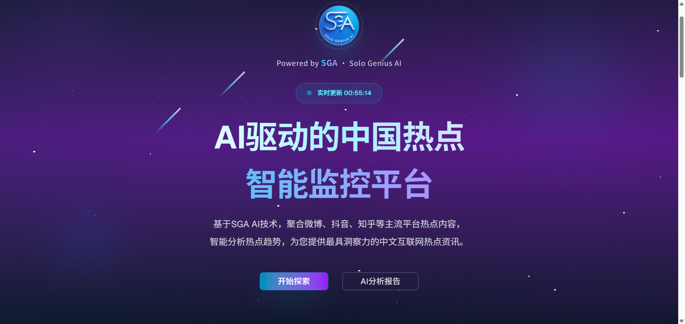

<div align="center">
<h1>🌟 SGA DailyHot AI 热点监控平台</h1>
<p>基于 AI 驱动的中文热点聚合监控平台 | 35个数据源 | DeepSeek AI 深度分析</p>
<br />


</div>


## ✨ 核心特性

🤖 **AI 驱动分析** - 集成 DeepSeek AI，提供5大维度深度热点分析
🌟 **星辰大海界面** - 120+动画元素的宇宙主题UI，视觉震撼
📊 **35个数据源** - 覆盖科技、新媒体、实时新闻、财经四大分类
🚀 **Docker 一键部署** - 完整的容器化解决方案
⚡ **极速响应** - Redis缓存 + 智能去重，毫秒级响应
🔄 **实时更新** - 自动缓存刷新，数据始终保持最新
📱 **响应式设计** - 完美适配桌面端和移动端
🛡️ **生产就绪** - 完善的错误处理和监控机制

### 🖼️ 界面预览



**特色功能展示:**
- 🌌 **星辰大海动画** - 120个星星闪烁 + 3个流星轨迹 + 3个星云浮动
- 🤖 **DeepSeek AI 分析** - 实时流式输出，5大维度深度分析
- 📊 **四大分类聚合** - 科技、新媒体、实时新闻、财经
- ⚡ **实时数据更新** - 毫秒级响应，数据实时同步

## � 快速开始

### Docker 一键部署 (推荐)

```bash
# 克隆项目
git clone https://github.com/sga-jerrylin/DailyHotApi-sga.git
cd DailyHotApi-sga

# Windows 用户
deploy.bat

# Linux/macOS 用户
chmod +x docker-deploy.sh
./docker-deploy.sh
```

部署完成后访问:
- 🌐 **前端界面**: http://localhost:3000
- 🔌 **API服务**: http://localhost:6688

## 📡 API 调用指南

### 🎯 基础调用

所有API接口均支持GET请求，返回JSON格式数据。

**基础URL**: `http://localhost:6688` (本地部署) 或 `https://your-domain.com`

### 📊 单个数据源调用

获取特定平台的热点数据：

```bash
# 获取微博热搜
curl "http://localhost:6688/weibo"

# 获取知乎热榜
curl "http://localhost:6688/zhihu"

# 获取GitHub趋势
curl "http://localhost:6688/github"
```

**响应格式:**
```json
{
  "code": 200,
  "message": "获取成功",
  "name": "weibo",
  "title": "微博热搜",
  "type": "热搜榜",
  "total": 50,
  "updateTime": "2025-08-12T16:54:28.000Z",
  "data": [
    {
      "id": 1,
      "title": "热点标题",
      "desc": "热点描述",
      "url": "https://example.com",
      "hot": 1234567,
      "timestamp": 1691856868000,
      "mobileUrl": "https://m.example.com"
    }
  ]
}
```

### 🗂️ 分类聚合调用

获取按分类聚合的热点数据：

```bash
# 获取所有分类的聚合数据
curl "http://localhost:6688/aggregate"

# 获取特定分类 (科技)
curl "http://localhost:6688/aggregate?category=tech"

# 获取多个分类 (科技+新媒体)
curl "http://localhost:6688/aggregate?category=tech,media"

# 限制每个分类的数量
curl "http://localhost:6688/aggregate?category=tech&limit=20"
```

**分类说明:**
- `tech` - 科技 (36kr, IT之家, CSDN, 稀土掘金, GitHub等)
- `media` - 新媒体 (微博, 知乎, 抖音, B站, 豆瓣等)
- `news` - 实时新闻 (腾讯新闻, 新浪新闻, 澎湃新闻等)
- `finance` - 财经 (36kr, 澎湃新闻, 虎嗅等)

### 📋 按数据源分组调用

获取按数据源分组的详细数据：

```bash
# 按数据源分组，每个源最多5条
curl "http://localhost:6688/aggregate?group=source&per=5"

# 获取科技分类的分组数据
curl "http://localhost:6688/aggregate?category=tech&group=source&per=10"
```

**分组响应格式:**
```json
{
  "code": 200,
  "name": "aggregate",
  "title": "聚合",
  "total": 167,
  "categories": [
    {
      "key": "tech",
      "label": "科技",
      "total": 43,
      "data": [...]
    }
  ],
  "groups": [
    {
      "route": "juejin",
      "title": "稀土掘金",
      "total": 8,
      "updateTime": "2025-08-12T16:54:13.000Z",
      "data": [...]
    }
  ]
}
```

### 🤖 AI 分析调用

获取 DeepSeek AI 深度分析：

```bash
# 获取热点趋势AI分析
curl -X POST "http://localhost:6688/ai-analysis" \
  -H "Content-Type: application/json" \
  -d '{
    "categories": ["tech", "media"],
    "limit": 50
  }'
```

**AI分析响应:**
```json
{
  "code": 200,
  "message": "分析完成",
  "analysis": {
    "summary": "今日热点趋势总结...",
    "trends": ["趋势1", "趋势2"],
    "insights": "深度洞察...",
    "recommendations": "建议关注..."
  },
  "model": "deepseek-chat",
  "timestamp": 1691856868000
}
```

## 📊 完整数据源列表

### 🚀 科技分类 (tech)
| **平台** | **调用名称** | **描述** | **示例** |
|---------|-------------|---------|---------|
| 36氪 | `36kr` | 科技创投资讯 | `GET /36kr` |
| IT之家 | `ithome` | 科技新闻热榜 | `GET /ithome` |
| IT之家喜加一 | `ithome-xijiayi` | 游戏福利动态 | `GET /ithome-xijiayi` |
| CSDN | `csdn` | 技术博客排行 | `GET /csdn` |
| 稀土掘金 | `juejin` | 技术社区热榜 | `GET /juejin` |
| 极客公园 | `geekpark` | 科技产品资讯 | `GET /geekpark` |
| 爱范儿 | `ifanr` | 科技生活方式 | `GET /ifanr` |
| HelloGitHub | `hellogithub` | 开源项目推荐 | `GET /hellogithub` |
| NodeSeek | `nodeseek` | 技术讨论社区 | `GET /nodeseek` |
| LinuxDo | `linuxdo` | Linux技术社区 | `GET /linuxdo` |
| GitHub | `github` | 开源趋势榜 | `GET /github` |
| ProductHunt | `producthunt` | 产品发现平台 | `GET /producthunt` |

### 📱 新媒体分类 (media)
| **平台** | **调用名称** | **描述** | **示例** |
|---------|-------------|---------|---------|
| 微博 | `weibo` | 微博热搜榜 | `GET /weibo` |
| 知乎 | `zhihu` | 知乎热榜 | `GET /zhihu` |
| 知乎日报 | `zhihu-daily` | 知乎日报推荐 | `GET /zhihu-daily` |
| 抖音 | `douyin` | 抖音热点榜 | `GET /douyin` |
| 快手 | `kuaishou` | 快手热点榜 | `GET /kuaishou` |
| 哔哩哔哩 | `bilibili` | B站热门榜 | `GET /bilibili` |
| AcFun | `acfun` | A站排行榜 | `GET /acfun` |
| 百度贴吧 | `tieba` | 贴吧热议榜 | `GET /tieba` |
| V2EX | `v2ex` | V2EX主题榜 | `GET /v2ex` |
| 什么值得买 | `smzdm` | 好价推荐 | `GET /smzdm` |
| 酷安 | `coolapk` | 酷安热榜 | `GET /coolapk` |
| 豆瓣小组 | `douban-group` | 豆瓣讨论精选 | `GET /douban-group` |
| 豆瓣电影 | `douban-movie` | 豆瓣新片榜 | `GET /douban-movie` |
| 微信读书 | `weread` | 微信读书飙升榜 | `GET /weread` |
| 游研社 | `yystv` | 游戏资讯 | `GET /yystv` |
| 虎扑 | `hupu` | 虎扑步行街热帖 | `GET /hupu` |

### 📰 实时新闻分类 (news)
| **平台** | **调用名称** | **描述** | **示例** |
|---------|-------------|---------|---------|
| 腾讯新闻 | `qq-news` | 腾讯新闻热点 | `GET /qq-news` |
| 新浪新闻 | `sina-news` | 新浪新闻热点 | `GET /sina-news` |
| 新浪网 | `sina` | 新浪热榜 | `GET /sina` |
| 网易新闻 | `netease-news` | 网易新闻热点 | `GET /netease-news` |
| 澎湃新闻 | `thepaper` | 澎湃新闻热榜 | `GET /thepaper` |
| 纽约时报 | `nytimes` | 纽约时报中文网 | `GET /nytimes` |
| 百度 | `baidu` | 百度热搜榜 | `GET /baidu` |
| 中央气象台 | `weatheralarm` | 全国气象预警 | `GET /weatheralarm` |
| 中国地震台 | `earthquake` | 地震速报 | `GET /earthquake` |

### 💰 财经分类 (finance)
| **平台** | **调用名称** | **描述** | **示例** |
|---------|-------------|---------|---------|
| 36氪 | `36kr` | 创投财经资讯 | `GET /36kr` |
| 澎湃新闻 | `thepaper` | 财经新闻 | `GET /thepaper` |
| 虎嗅 | `huxiu` | 商业科技资讯 | `GET /huxiu` |

</details>

## 🛠️ 高级配置

### 📦 NPM 包使用

```bash
# 安装依赖
npm install dailyhot-api-sga

# 或使用 pnpm
pnpm add dailyhot-api-sga
```

```js
import { serveHotApi } from "dailyhot-api-sga";

// 启动服务器
serveHotApi({
  port: 6688,
  redis: {
    host: "localhost",
    port: 6379
  },
  ai: {
    provider: "deepseek",
    apiKey: "your-api-key"
  }
});
```

### 🔧 环境变量配置

创建 `.env` 文件：

```bash
# 服务端口
PORT=6688

# 允许的域名
ALLOWED_DOMAIN="*"
ALLOWED_HOST="*"

# Redis配置
REDIS_HOST="localhost"
REDIS_PORT=6379
REDIS_PASSWORD=""

# 缓存时长（秒）
CACHE_TTL=3600

# 请求超时（毫秒）
REQUEST_TIMEOUT=8000

# 日志输出
USE_LOG_FILE=true

# RSS模式
RSS_MODE=false

# DeepSeek AI配置
DEEPSEEK_API_KEY="sk-your-api-key"
```

## 🚀 多种部署方式

### 🐳 Docker 部署 (推荐)

**完整平台部署 (前端+后端+Redis):**

```bash
# 克隆项目
git clone https://github.com/sga-jerrylin/DailyHotApi-sga.git
cd DailyHotApi-sga

# Windows 用户
deploy.bat

# Linux/macOS 用户
chmod +x docker-deploy.sh
./docker-deploy.sh
```

**仅后端API部署:**

```bash
# 本地构建
docker build -t sga-dailyhot-api .
docker run -d -p 6688:6688 --name dailyhot-api sga-dailyhot-api

# 或使用 Docker Hub 镜像
docker pull sga-jerrylin/dailyhot-api:latest
docker run -d -p 6688:6688 --name dailyhot-api sga-jerrylin/dailyhot-api:latest
```

### 🔧 手动部署

```bash
# 克隆项目
git clone https://github.com/sga-jerrylin/DailyHotApi-sga.git
cd DailyHotApi-sga

# 安装依赖
npm install
# 或使用 pnpm
pnpm install

# 复制环境变量文件
cp .env.example .env

# 开发模式
npm run dev

# 生产模式
npm run build
npm run start
```

### ⚡ PM2 部署

```bash
# 安装 PM2
npm install -g pm2

# 使用部署脚本
chmod +x deploy.sh
./deploy.sh

# 或手动启动
pm2 start ecosystem.config.cjs
```


### 🔍 健康检查

部署完成后，运行健康检查：

```bash
# Windows
health-check.bat

# Linux/macOS
chmod +x health-check.sh
./health-check.sh
```

## 🤖 AI 分析功能

### DeepSeek AI 集成

本项目集成了 DeepSeek AI，提供智能热点分析功能：

**分析维度:**
- 📈 **趋势分析** - 识别热点发展趋势
- 🔍 **关键词提取** - 提取核心关键信息
- 📊 **情感分析** - 分析公众情感倾向
- 🎯 **影响评估** - 评估热点影响范围
- � **洞察建议** - 提供专业洞察建议

**使用方法:**
```bash
# 前端界面
访问 http://localhost:3000，点击"开始 DeepSeek AI 分析"

# API调用
curl -X POST "http://localhost:6688/ai-analysis" \
  -H "Content-Type: application/json" \
  -d '{"categories": ["tech", "media"], "limit": 50}'
```

## 📊 性能特性

- ⚡ **极速响应** - Redis缓存，平均响应时间 < 100ms
- 🔄 **智能缓存** - 默认1小时TTL，可配置
- 🛡️ **容错机制** - 数据源失败时自动降级
- 📈 **负载均衡** - 支持多实例部署
- 🔍 **智能去重** - 基于URL和标题的智能去重
- 📱 **跨平台** - 支持所有主流操作系统

## ⚠️ 使用须知

- 🕐 **缓存机制** - 为避免频繁请求，默认缓存1小时，可通过环境变量调整
- 🤖 **爬虫规范** - 部分接口使用页面爬虫，严格遵守robots.txt规则
- 🔒 **API限制** - 建议设置合理的请求频率限制
- 📊 **数据准确性** - 数据来源于各平台公开接口，准确性以原平台为准

## 🤝 贡献指南

欢迎提交 Issue 和 Pull Request！

1. Fork 本项目
2. 创建特性分支 (`git checkout -b feature/AmazingFeature`)
3. 提交更改 (`git commit -m 'Add some AmazingFeature'`)
4. 推送到分支 (`git push origin feature/AmazingFeature`)
5. 开启 Pull Request

## 📄 开源协议

本项目基于 [MIT License](./LICENSE) 开源协议。

## � 致谢

感谢以下项目和开发者的支持：

- [RSSHub](https://github.com/DIYgod/RSSHub) - RSS聚合灵感来源
- [DeepSeek AI](https://www.deepseek.com/) - AI分析能力支持
- [Hono](https://hono.dev/) - 高性能Web框架
- [Next.js](https://nextjs.org/) - React全栈框架
- [Redis](https://redis.io/) - 高性能缓存数据库

## ⭐ Star History

[](https://star-history.com/#sga-jerrylin/DailyHotApi-sga&Date)

---

<div align="center">
<p>🌟 <strong>SGA AI 驱动，星辰大海无限！</strong> 🌟</p>
<p>如果这个项目对你有帮助，请给个 ⭐ Star 支持一下！</p>
</div>
